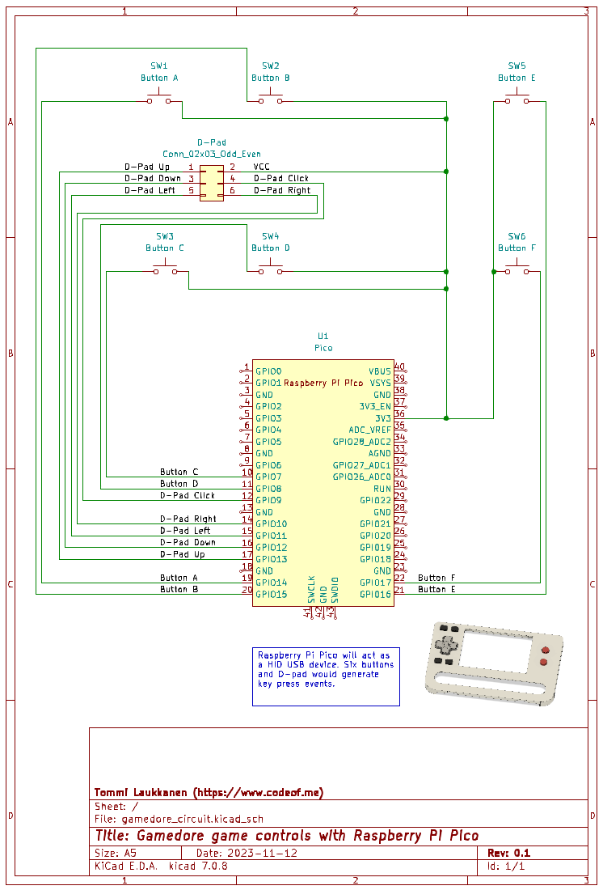

# Raspberry Pi Pico game controller

This is a simple Micropython script for setting up your Raspberry Pi Pico to act as game controller. This setup uses six buttons and d-pad control.

You can use for example the following wiring:

I created this to be used with my Gamedore 2064 gaming handheld device. You can read more information about that from my blog:

[https://www.codeof.me](https://www.codeof.me)

